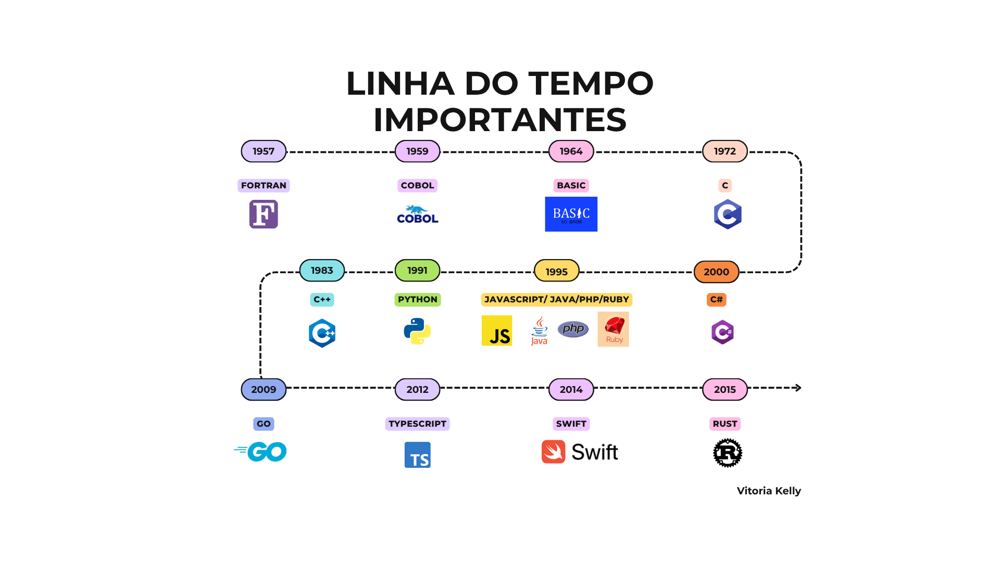

## 🗓️ Linha do Tempo – Marcos Relevantes

- **1843 – Ada Lovelace** desenvolve o primeiro algoritmo para a Máquina Analítica de Babbage — considerado o primeiro programa de computador. 
- **1942–45 – Plankalkül (Konrad Zuse)**: a primeira linguagem de alto nível, embora nunca tenha sido implementada na época. 
- **1949 – Assembly e Shortcode**: primeiras linguagens intermediárias entre código-máquina e humano.
- **1952 – Autocode**: compilada para máquina, criada para o Mark I. 
- **1957 – FORTRAN**: primeira linguagem de alto nível amplamente usada, projetada para cálculos científicos. 
- **1958 – ALGOL e LISP**: ALGOL fundou a base de linguagens modernas; LISP, pioneira em IA.
- **1959 – COBOL**: desenhada por Grace Hopper para aplicações de negócio com sintaxe próxima ao inglês.
- **1964 – BASIC**: linguagem didática para democratizar o acesso à programação. 
- **Décadas de 1960–70 – Estruturação e paradigmas modernos**:
  - **1970 – Pascal**, para ensino;
  - **1972 – C**, altamente influente;
  - **1972 – Smalltalk**, precursor da programação orientada a objetos;
  - **1972 – Prolog**, focada em lógica;
  - **1973 – ML**, introduziu tipagem funcional; **1975 – Scheme**; **1978 – SQL**; **1967 – BCPL, B, Logo**. 
- **1983 – C++ / Objective‑C**: extensão do C com suporte a objetos. 
- **1987 – Perl**: linguagem de script poderosa e flexível, conhecida pela “filosofia que aceita múltiplas formas de resolver problemas”. 
- **1991 – Python, Visual Basic, Lua**: Python trouxe legibilidade, VB GUI fácil, Lua leve para embutir.
- **1995 – Java, PHP, Ruby, JavaScript**: explosão de linguagens para web e sistemas portáveis. 
- **2000s–2010s – Novos paradigmas & concorrência**:
  - **2000 – C#** (Microsoft);
  - **2003 – Scala** (funcional + OO);
  - **2009 – Go** (concorrência e escalabilidade);
  - **2011 – Kotlin** (compatível com Java/JVM);
  - **2012 – TypeScript** (tipos estáticos sobre JS);
  - **2014 – Swift** (linguagem moderna da Apple);
  - **2015 – Rust** (segurança de memória e alta performance). 

