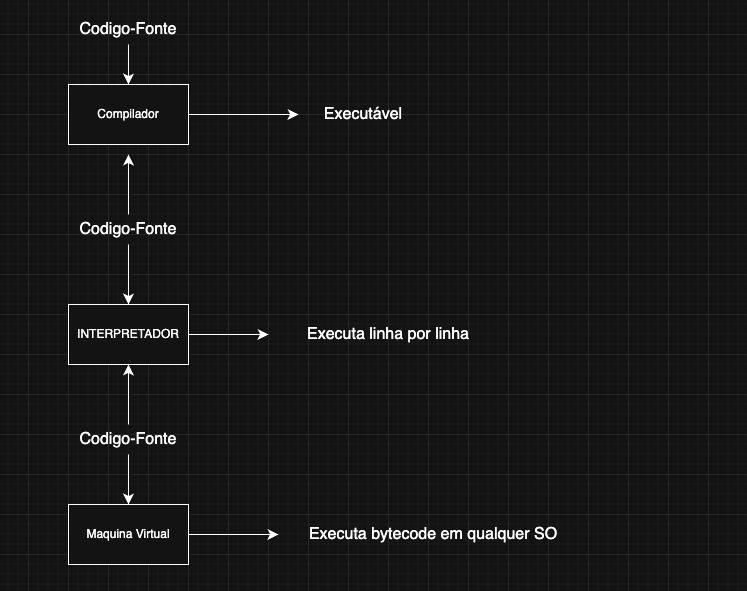

# 🖥️ Compiladores, Interpretadores e Máquinas Virtuais

Este diagrama explica como cada tecnologia processa e executa um programa a partir do código-fonte.

---

## 🔹 Compilador

- **O que é:** Traduz todo o código-fonte para linguagem de máquina antes da execução.
- **Vantagem:** Programas executam mais rápido porque já estão compilados.
- **Desvantagem:** Erros só são percebidos após a compilação.
- **Exemplos:** C, C++, Go, Rust.

---

## 🔹 Interpretador

- **O que é:** Lê e executa o código **linha por linha**, em tempo real.
- **Vantagem:** Ideal para testes rápidos e scripts.
- **Desvantagem:** Execução mais lenta porque traduz durante a execução.
- **Exemplos:** Python, JavaScript, PHP.

---

## 🔹 Máquina Virtual

- **O que é:** Executa programas em um **bytecode independente do sistema operacional**.
- **Funcionamento:** O código-fonte é compilado em bytecode, que é interpretado pela VM.
- **Vantagem:** Portabilidade (roda em qualquer SO que tenha a VM).
- **Exemplos:** Java (JVM), C# (.NET CLR), Kotlin (JVM).

---

## 📊 Diagrama

