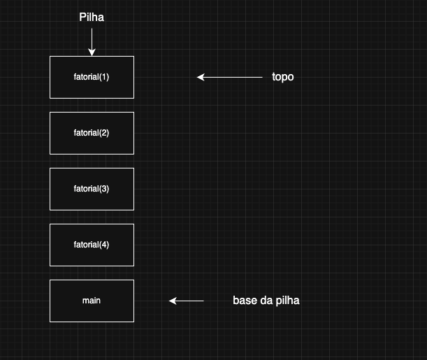

#  Desafio 07 – Implementação de Subprogramas

## 🎯 Objetivo

Demonstrar o funcionamento da **pilha de chamadas** (call stack) em um subprograma **recursivo**, por meio de:

- Código exemplo em **Python**
- Explicação da pilha de chamadas
- Diagrama ilustrado (sugestão: Draw.io)

---

